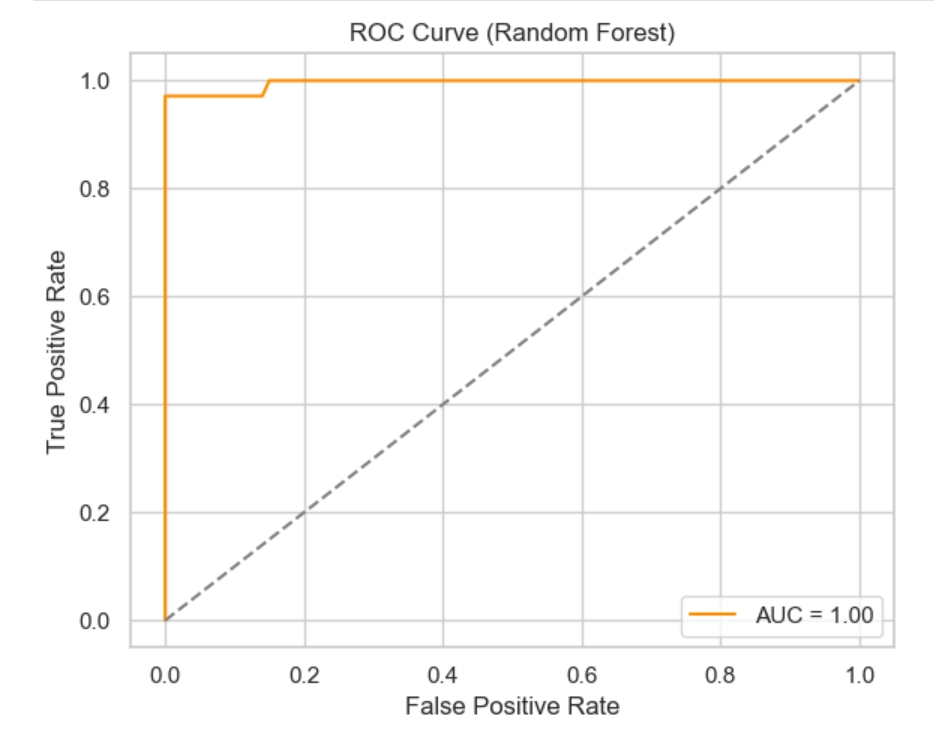
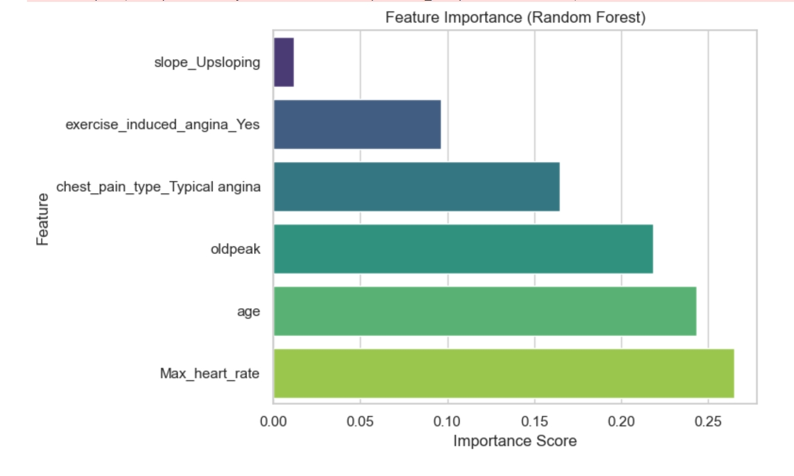

# 🫀 Heart Disease Prediction with Random Forest  
**Biomedical AI | Precision Medicine | University of Sindh**

This project applies machine learning to predict heart disease risk using clinical and demographic data. Built with a Random Forest classifier, it demonstrates how data-driven models can support early diagnosis and precision healthcare. Part of my academic portfolio in biomedical AI and translational data science.

---

## 📊 Dataset Overview

- **Source**: [Heart Disease Dataset (UCI version) by ketangangal on Kaggle](https://www.kaggle.com/datasets/ketangangal/heart-disease-dataset-uci)  
- **File Used**: `HeartDiseaseTrain-Test.csv` (113.4 kB)  
- **Description**: Contains anonymized patient records with 14 clinical features and 1 binary target label indicating heart disease presence.

---

## 🧪 Modeling Pipeline

- **Preprocessing**: Handled missing values, encoded categorical features, scaled numerical variables  
- **Feature Selection**: Identified top predictors using Random Forest’s built-in importance metrics  
- **Modeling**: Trained and compared Logistic Regression and Random Forest classifiers  
- **Evaluation**: Assessed performance using accuracy, precision, recall, F1 score, confusion matrix, ROC curve, and AUC score

---

## ✅ Key Results

- 🎯 **Accuracy**: 98.5%  
- 🧠 **Precision**: 100%  
- 🔍 **Recall**: 97.1%  
- 📊 **F1 Score**: 98.6%  
- 📈 **AUC Score**: 1.00 (Perfect classification)  
- ❌ **Confusion Matrix**: 0 false positives, 3 false negatives  
- 🔬 **Top Predictors**: Max heart rate, age, ST depression (oldpeak), chest pain type

---

## 📈 Visual Insights

  
*The ROC curve illustrates flawless separation between positive and negative cases.*

  
*Max heart rate and age emerged as dominant features in predicting cardiac risk.*

---

## 🛠️ Technologies Used

- Python  
- Jupyter Notebook  
- Scikit-learn  
- Pandas, NumPy  
- Matplotlib, Seaborn

---

## 🚀 Next Steps & Future Work

- Extend to multiclass classification for severity levels  
- Integrate time-series ECG or imaging data for multimodal analysis  
- Compare ensemble methods (e.g., XGBoost, LightGBM)  
- Explore SHAP values for deeper interpretability  
- Publish results in a reproducible research format

---

## 📎 Notebook Preview

If GitHub preview fails, view the notebook on [nbviewer](https://nbviewer.org/github/MureedSajjad/heart-disease-prediction/blob/main/Heart_Disease_Prediction_RF_BiomedicalAI.ipynb)

---

`#MachineLearning` `#BiomedicalAI` `#HeartDisease` `#DataScience` `#JupyterNotebook` `#PrecisionMedicine` `#OpenScience`
